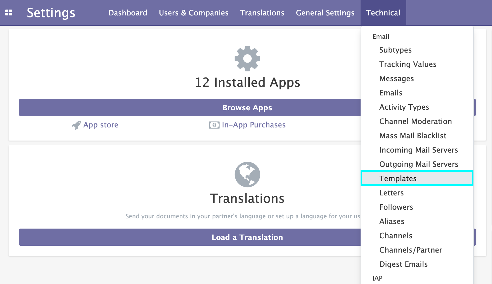
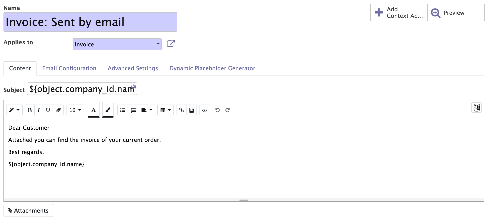
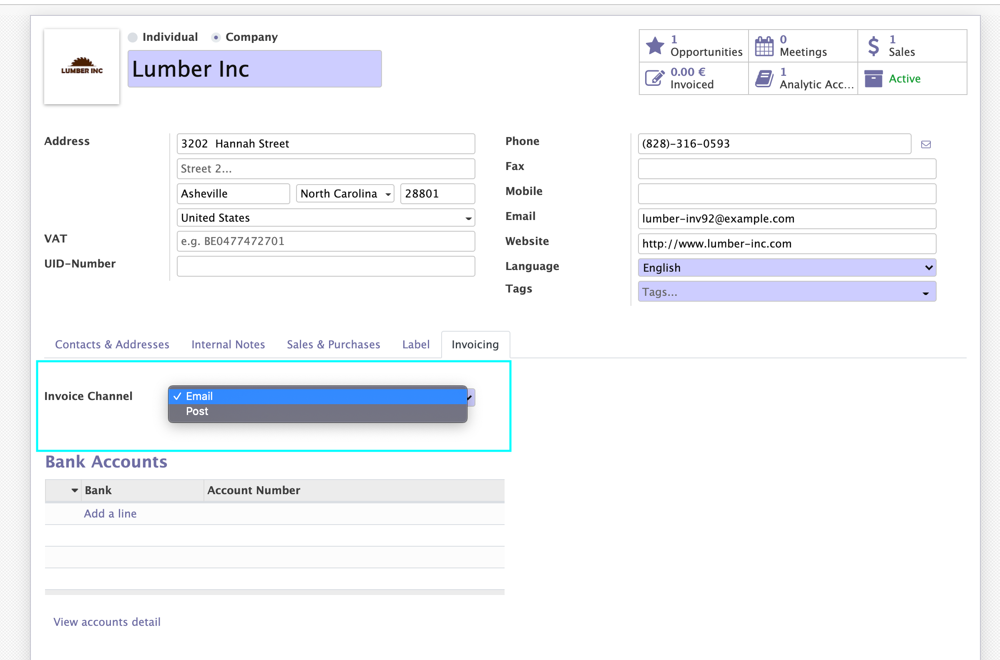

    <a href="https://www.odoo.com/documentation/12.0/index.html">
        </img>
    </a>
    <a href="http://www.alliantum.com">
        </img>
    </a>
    <a href="http://www.gnu.org/licenses/agpl-3.0-standalone.html">
        </img>
    </a>

    
    

        <h1>Automatic Mailing</h1>
        When a Sales Order or an Invoice gets confirmed this module sends an email to the customer automatically.
        

    

## Installation

Nothing is required for this application to work, just like a regular module. But of course for this to work you will need to have configured your [outgoing mail server](https://www.odoo.com/documentation/user/14.0/discuss/advanced/email_servers.html#how-to-manage-outbound-messages).

## Usage

After the installation this is the step to follow to set all up for your company:
- First you will need to go to change the email template that will be sent.  
To do that you will need to go to settings (in [debug mode](https://www.odoo.com/documentation/user/14.0/general/developer_mode/activate.html)) and go to Technical tab --> on _email_ select _Templates_ and search this two templates:
    - "`Invoice: Sent by email`"
    - "`Sales Order: Sent by email`"
    

        
        
    

Also by default all customers are going to receive emails whether an invoice is generated but if you want to not notify certain customers you can change it on the customer view in the invoicing tab like so:
    

        
    

## Contributors

- [Alliantum](http://www.alliantum.com)

